# Computer Vision Multi Threading Sobel Filter

This project demonstrates a complete workflow using **C++, CMake, and OpenCV** for both images and videos. It covers device recognition, frame capture, grayscale conversion, edge detection, and a **multi-threaded Sobel filter implementation** to improve performance.

## 🧠 Project Overview
This repository is structured to show incremental development and learning:

1. **Build Verification** – Confirm the C++ / CMake / OpenCV toolchain works correctly.
2. **Image Processing Pipeline** – Convert images to grayscale and apply basic preprocessing.
3. **2D Sobel Filter** – Apply Sobel edge detection to static images.
4. **Video Sobel Filter** – Apply Sobel filtering frame-by-frame on video input.
5. **Multi-Threaded Sobel Filter** – Improve performance using C++ threading.

You will need:

- **MSYS2** (MinGW64 toolchain)
- **OpenCV**
- **CMake**
- **Visual Studio Code** (optional, recommended)


## Purpose of each Versions
Each version includes its own **CMake configuration** and corresponding `main.cpp` source file. The project is structured to demonstrate a gradual progression from basic setup validation to advanced, multi-threaded computer vision processing.

*NOTE:* For the multithreading implementations, this project uses the [Windows threading API](https://learn.microsoft.com/en-us/windows/win32/procthread/processes-and-threads) since development was done on **Windows 11** and most students in my program use Windows. The underlying threading concepts are platform-independent. If you are working on Linux, you can substitute the Windows API with [POSIX threads (pthreads)](https://man7.org/linux/man-pages/man7/pthreads.7.html) and follow the same logical structure.


### Version Breakdown

- **Version 1** – Validate that **C++, CMake, and OpenCV** are correctly installed and working together.
- **Version 2** – Implement a basic OpenCV image processing pipeline *(BGR → Grayscale → Threshold)*.
- **Version 3** – Apply a **2D Sobel filter** to a static image.
- **Version 4** – Apply a **2D Sobel filter** to video or GIF input.
- **Version 5** – Implement a **multi-threaded Sobel filter** for image processing.
- **Version 6** – Implement a **multi-threaded Sobel filter** for video processing.


## Treelist of the directory

Computer Vision Multi Threading Sobel Filter:
|
|
|   CMakeList.txt
|   README.md
|   treelist.txt
|   
+---archive
|   +---Version_1
|   \---Version_2
+---pictures
|       test.jpg
|       
+---picture_reference_readme
|       image-1.png
|       image-10.png
|       image-11.png
|       image-12.png
|       image-13.png
|       image-14.png
|       image-15.png
|       image-16.png
|       image-17.png
|       image-18.png
|       image-19.png
|       image-2.png
|       image-20.png
|       image-21.png
|       image-22.png
|       image-23.png
|       image-24.png
|       image-25.png
|       image-3.png
|       image-4.png
|       image-5.png
|       image-6.png
|       image-7.png
|       image-8.png
|       image-9.png
|       image.png
|       
\---src
        main.cpp
        


# Environment Setup: OpenCV, GCC (C++), CMake, and Visual Studio Code

## Visual Studio Code

This project uses [Visual Studio Code](https://code.visualstudio.com) as the primary code editor. You are free to use any editor of your choice, but VS Code is recommended for its extension ecosystem and CMake integration.

### Recommended Extensions
Open the **Extensions** tab in Visual Studio Code and install the following recommended extensions to improve C++ development, IntelliSense, and debugging support.

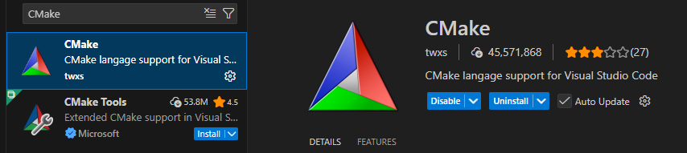
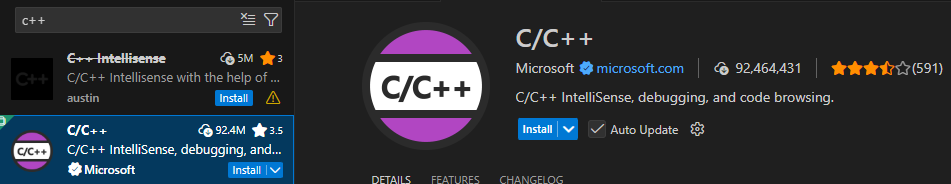


## Installing and Setting Up the GCC Compiler
To install the GCC compiler on Windows 10/11, download and install [MSYS2](https://www.msys2.org). Follow the standard installation steps. It is recommended to keep the **default installation path**, as it will be referenced later by CMake and environment variables. If you are new to coding:

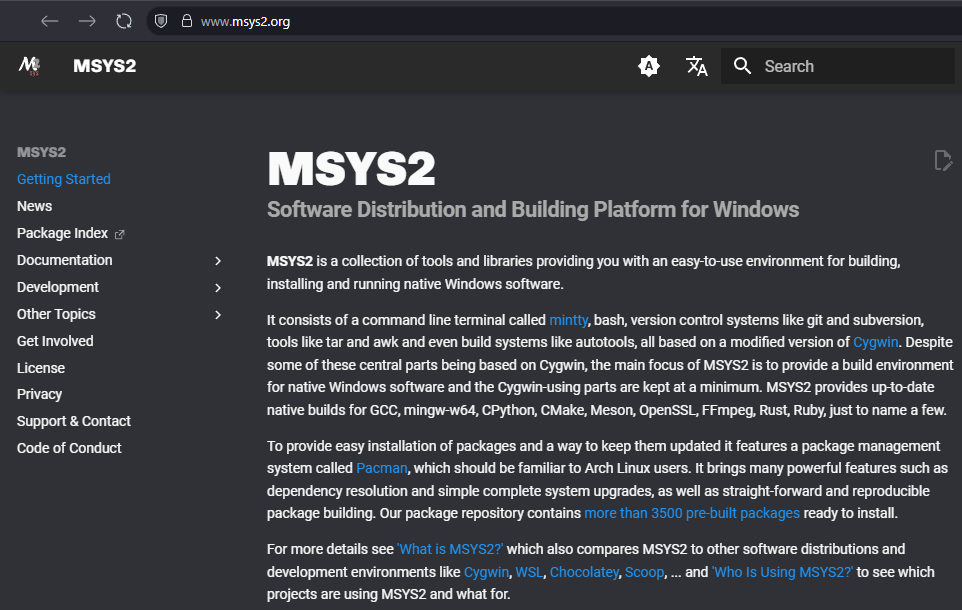

Navigate to:
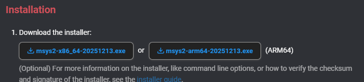

Download the installer and run it. Windows security prompts may appear—allow the installation to proceed. It is recommended to keep the default installation path, as this directory will be referenced later by CMake.

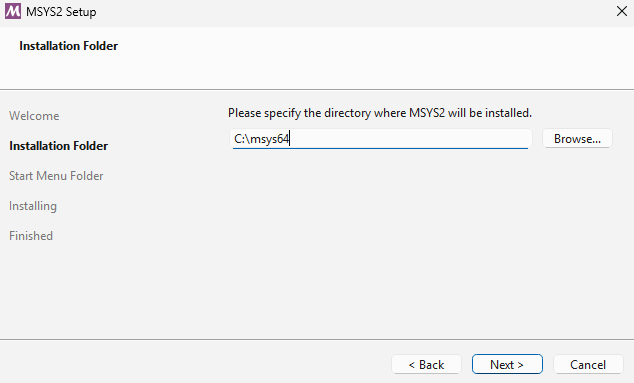

Once installation is done, run MSYS2. 

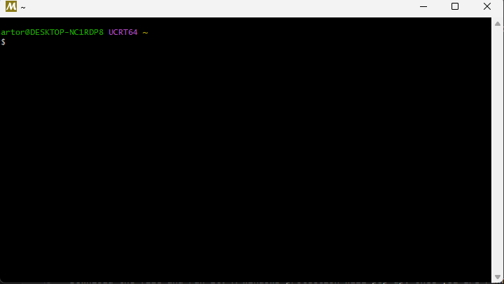

Before continuing, update the entire compiler toolchain to reduce the chance of issues later on.
```bash
pacman -Syu
```

Then type in:
```bash
pacman -S mingw-w64-x86_64-gcc
```

To verify we have the GCC Compiler, do the following command:
```bash
gcc --version
```
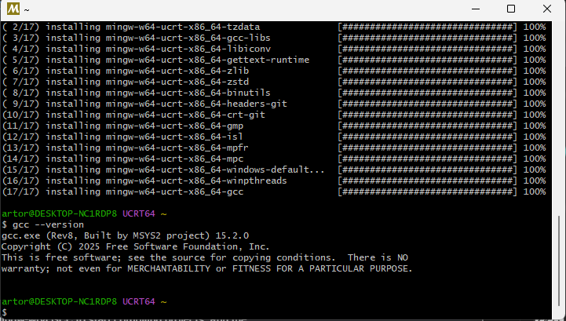


Now that the GCC compiler is installed, we need to update the **environment variables** so Windows knows where to find the compiler and can use it in Visual Studio Code. Open **Start**, type **Edit environment variables for your account**, and open it.


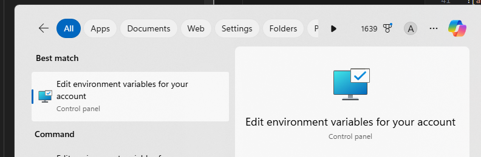

Your window may look slightly different (variables wise), but the layout and options should be essentially the same.
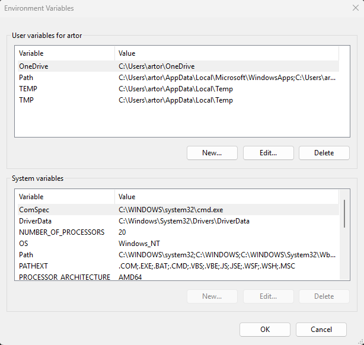

Double click variable **Path**

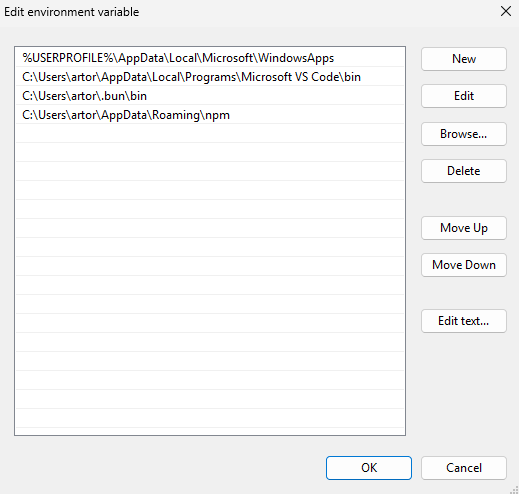

Select a empty line/cell (assuming you used the default path for MSYS2):
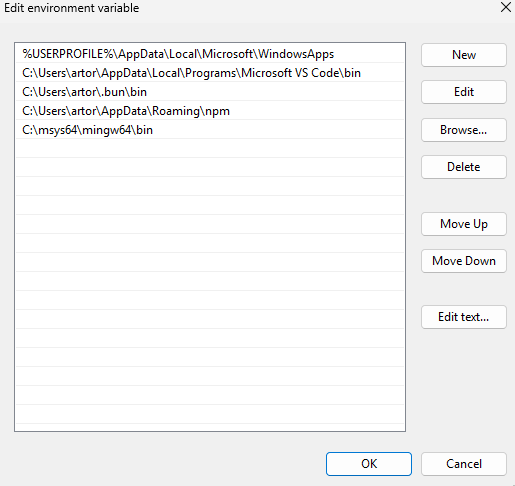
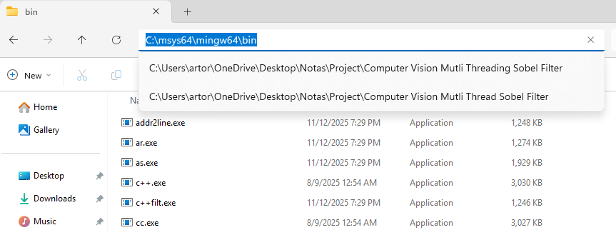

Click Ok, twice. The second image shows you what the pacman command does. From here, we can use GCC Compiler!


## Installing and Setting CMake
Go to the [CMake download page](https://cmake.org/download/) and select the installer for your operating system. If you are using Windows, it is recommended to choose the **Windows x64 Installer**.
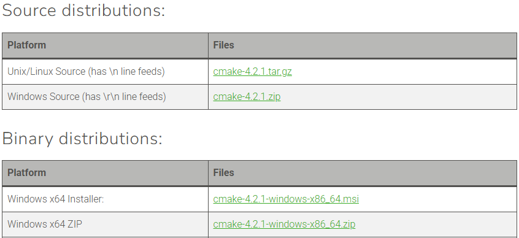

Double-click the `.msi` file and use the default installation path to avoid issues later.
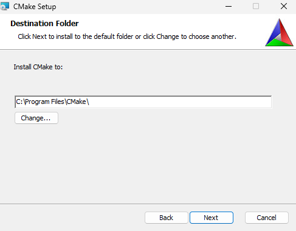

Open **Edit environment variables for your account**, go to **Path**, double-click it, and add the following path in an empty entry (if you used the default install location):

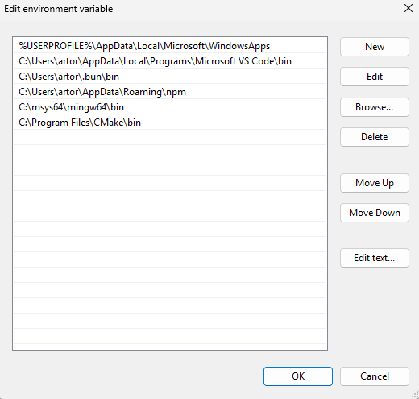
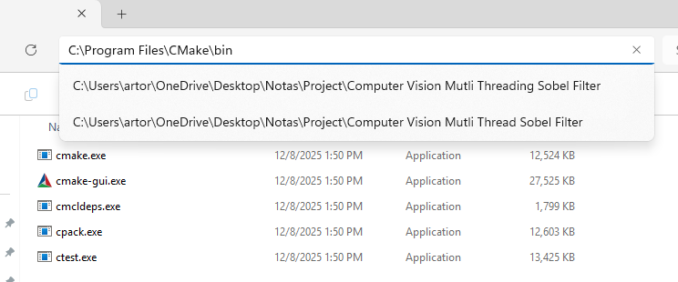

Click Ok, twice. Now windows can use CMake commands in Visual Studio Code!

## Installing and Setting up OpenCV

### Option 1: MSYS2 installation 
I barely found out about this but try the following command:
```bash
pacman -Syu
pacman -S mingw-w64-x86_64-opencv
``` 

If you are using option 2 installation and want to switch to option 1. Go to **Edit environment variables for your account** and delete the 3 paths you set for OpenCV for option 2!!!. Just know that it will download the [latest version of OpenCV](https://opencv.org/blog/opencv-4-0/). Read the requirements for CMake minimum requirement!


### Option 2: Install OpenCV Manually
Go to the [OpenCV releases page](https://opencv.org/releases/), select the Windows version, download it, and run the installer.
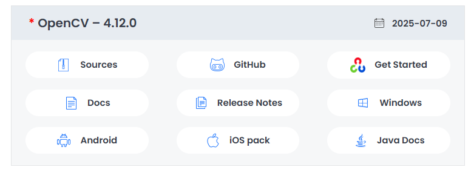

This is the only step where changing the installation directory is recommended. If you plan to use OpenCV frequently, choose a global location; otherwise, you may place it in a local folder.
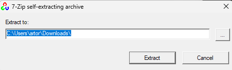

To:
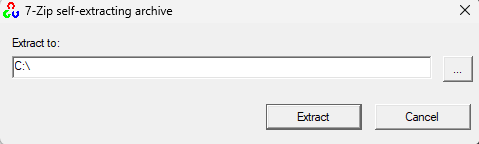
This setup is easier and has worked well on most clean installations. After extraction is complete, a few steps are needed so Windows and CMake can recognize OpenCV. Start by opening **Edit environment variables for your account**.

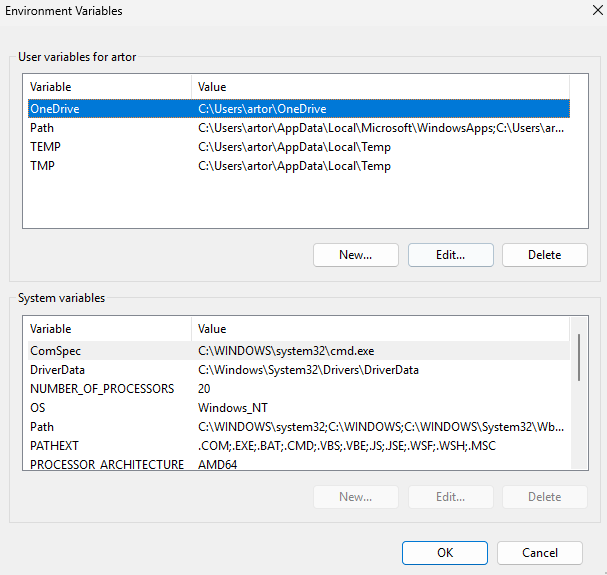

Click **New**, enter `OpenCV_DIR` as the variable name, and set the value to `C:\opencv\build`. Make sure the spelling is correct, as this is required for CMake to find OpenCV.

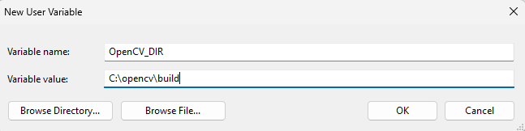

Click **OK** once. This step allows CMake to locate and correctly build against the OpenCV library.

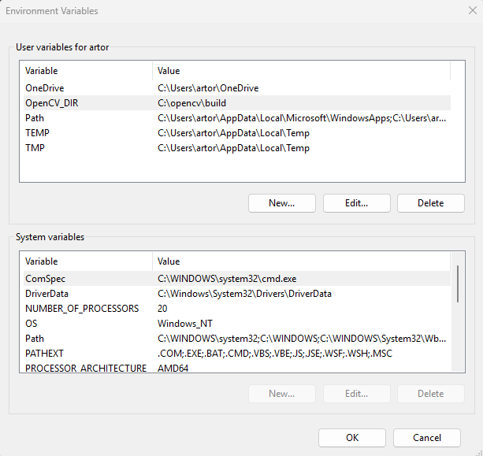
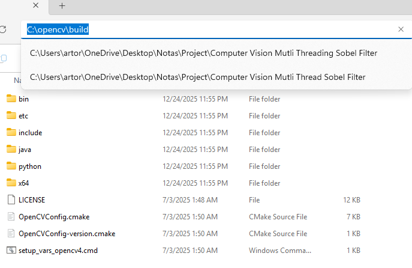


In **Edit environment variables for your account**, double-click **Path** and add the following entries in separate empty fields:
- `C:\opencv\build\x64\vc16\bin`
- `C:\opencv\build\x64\vc16\lib`


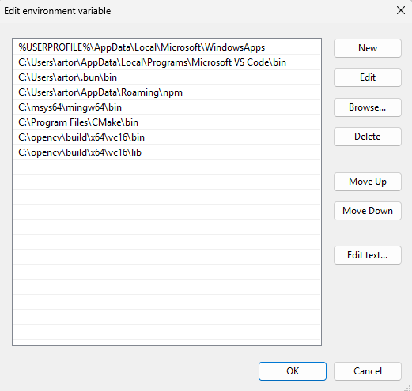
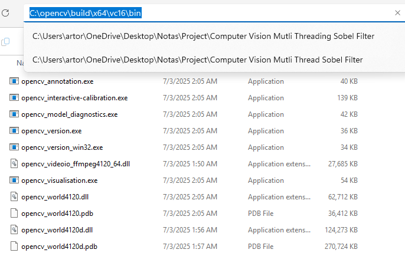
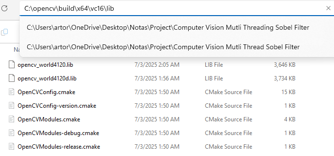

Click **OK** twice to save the changes. Visual Studio Code should now be able to find the OpenCV libraries.


# The basics environment build requirements
If you run into build issues, double-check the paths in **Edit environment variables for your account** and review the steps above. CMake and OpenCV can be tricky to set up, and small mistakes in paths can cause big problems.

The steps below are the bare minimum needed for basic OpenCV usage. If your code compiles, you’re good to go.

If CMake runs without errors and OpenCV is recognized—congrats! This took me weeks to figure out on the job lol.


## CMakeList.txt file


```cmake
cmake_minimum_required(VERSION 3.5)

# Project name
project(OpenCVExample)

# Find OpenCV
find_package(OpenCV REQUIRED)

# Include directories from OpenCV
include_directories(${OpenCV_INCLUDE_DIRS})

# Add your source file(s)
add_executable(OpenCVExample src/main.cpp)

# Link OpenCV libraries
target_link_libraries(OpenCVExample ${OpenCV_LIBS})
```

### CMake troubleshoot: NMake issues
Open powershell and type in the following:
```bash
gcc --version
g++ --version
cmake --version
nmake --version
```

If you get an error from the first three then its your **Edit environment variables for your account**. If the 4th line is your issue where ever the project is open have the terminal or powershell in that directory. We are going to force some commands:
```bash
cmake -S . -B build -G "MinGW Makefiles" -DCMAKE_CXX_COMPILER=g++
```

If that doesnt work then I recommend installing OpenCV through MSYS2!. 


## Main file
```c++
#include <opencv2/opencv.hpp>
#include <iostream>

int main() {
    // Load an image (replace with your own file if needed)
    cv::Mat image = cv::imread("pictures/test.jpg");

    if (image.empty()) {
        std::cout << "Could not read the image!" << std::endl;
        return -1;
    }

    cv::imshow("Test Window", image);

    cv::waitKey(0);  // Wait for any key
    return 0;
}
```

### Last Recommendation:

If OpenCV shows red error lines in Visual Studio Code but your project compiles fine using CMake, the problem is with VS Code, not OpenCV. VS Code requires the libraries to be linked manually for IntelliSense. This is optional, but doing so enables function previews and better code completion. You can hover over the red underline to view the warning:

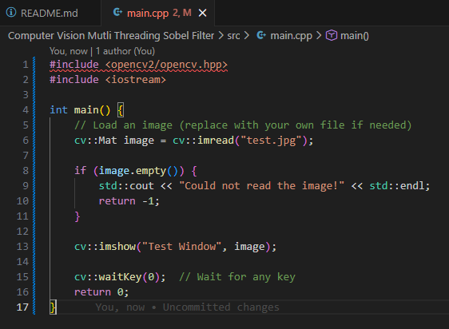
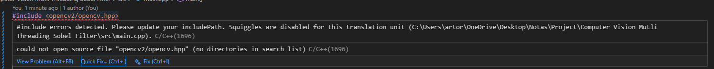


Select quick fix where you get the options of:
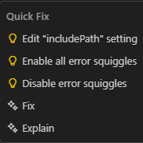

Select *Edit "includedPath" settings* where you get the following:


You only need to focus on two settings: **Compiler Path** and **Include Path**.

- **Compiler Path** points to the GCC compiler location.
- **Include Path** contains the OpenCV directories.

Your configuration should look similar to the example below:

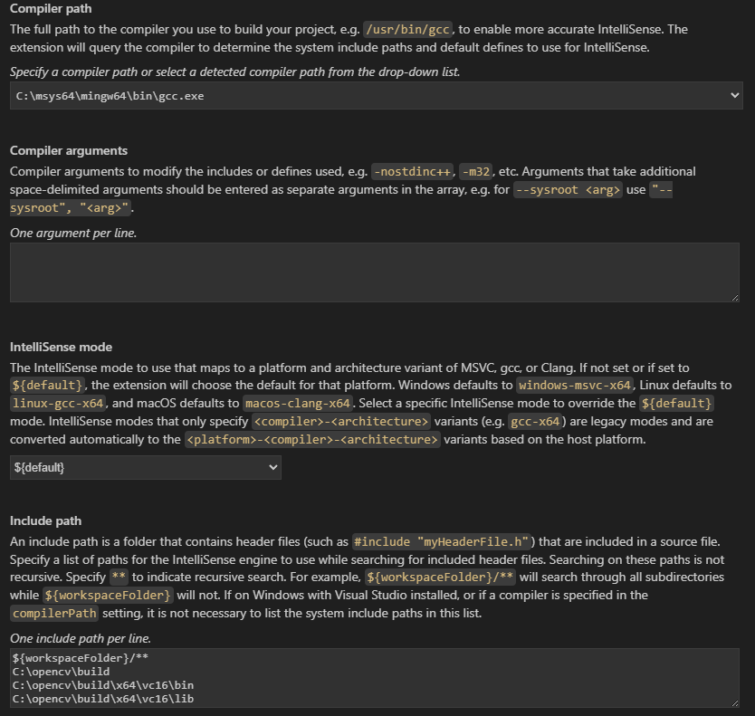

Restart Visual Studio Code. Restarting your computer is preferred to ensure all changes take effect.


# How to build and run an enviroment using CMake

## Option 1: MSYS2 OpenCV
### Building an Environment
```bash
cmake -S . -B build -G "MinGW Makefiles" -DCMAKE_C_COMPILER=gcc -DCMAKE_CXX_COMPILER=g++
cmake --build build
.\build\OpenCVExample.exe
```


### Delete/rebuild "build" folder
```bash
rmdir build -Recurse -Force
cmake -S . -B build -G "MinGW Makefiles" -DCMAKE_C_COMPILER=gcc -DCMAKE_CXX_COMPILER=g++
cmake --build build
.\build\OpenCVExample.exe
```


## Option 2: Maunally installed OpenCV
### Building an Environment
```bash
mkdir build
cmake -B .\build\
cmake --build .\build\ --config Release
.\Release\OpenCVExample.exe
```

### Option 1: Recommended to rebuild an enviornment for any changes in the code/cmake

```bash
cd ..
rmdir build 
```

then

```bash
mkdir build
cmake -B .\build\
cmake --build .\build\ --config Release
.\Release\OpenCVExample.exe
```

### Option 2: Delete "build" folder

Delete the build folder, it is quicker.
